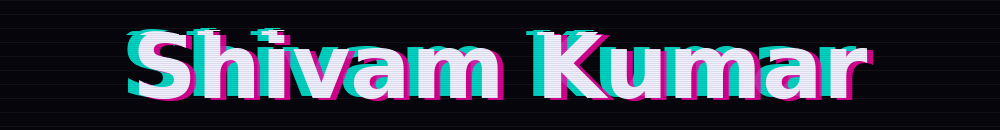

<!-- Banner -->
<div  >
  <a href="https://git.io/typing-svg"></a>
</div>

<div width="90%" height="130" align="center">
  
</div>


<!-- Typing animation -->
<div align="center" >
  <a href="https://github.com/shivamcoderrrr">
    
  </a>
</div>

<div align="center" gap="10">
  
  <a href="https://github.com/shivamcoderrrr?tab=followers">
    
  </a>
</div>

---

### 🧑‍💻 About Me

```js
const shivam = {
  name: "Shivam Kumar",
  pronouns: "he/him",
  role: "CSE 2nd-Yr",
  currentFocus: ["Data Structures & Algorithms", "Full Stack Dev + Devops"],
  lookingFor: "Open-source projects to collaborate on 🤝",
  hobby: "Beyond the syntax, I genuinely love coding exploring how raw logic translates into real-world applications
           and the deep-thinking puzzle of breaking down complex problems"
};
```


---

### 🛠️ Tech Stack

<div align="center">
  
</div>


---

### 📊 GitHub Stats


<div align="center">
  
</div>

---

### 📈 Contribution Graph

<div align="center">
  
</div>

---
<!--
### 🐍 Contribution Snake

<div align="center">
  <picture>
    <source media="(prefers-color-scheme: dark)" srcset="https://raw.githubusercontent.com/shivamcoderrrr/shivamcoderrrr/output/github-snake-dark.svg" />
    <source media="(prefers-color-scheme: light)" srcset="https://raw.githubusercontent.com/shivamcoderrrr/shivamcoderrrr/output/github-snake.svg" />
    
  </picture>
</div>
-->

<!--
---
### 🏆 Trophies

<div align="center">
  
</div>
-->
---

### 🧩 Coding Profiles (optional)

<!-- Delete this section if you don't use these. Replace YOUR_USERNAME. -->
<div align="center">
  <a href="https://leetcode.com/shivamcoder11"></a>
  <a href="https://codeforces.com/profile/shivam829241"></a>
</div>

---

### 🌐 Let's Connect

<div align="center">
  <a href="https://linkedin.com/in/shivam-kumar-914903361"></a>
  <a href="mailto:shivam829241@gmail.com"></a>
  <a href="https://twitter.com/shivam829241"></a>
</div>

<br/>

<div align="center">
  <i><span style="color: #ff4d4d;">"First, solve the problem. Then, write the code."</span></i> 
</div>

<!-- Footer -->
<div align="center">
  
</div>


<!--
**shivamcoderrrr/shivamcoderrrr** is a ✨ _special_ ✨ repository because its `README.md` (this file) appears on your GitHub profile.

Here are some ideas to get you started:
> The snake needs a small GitHub Action to work. See `snake.yml` (setup steps are in my message).

- 🔭 I’m currently working on ...
- 🌱 I’m currently learning ...
- 👯 I’m looking to collaborate on ...
- 🤔 I’m looking for help with ...
- 💬 Ask me about ...
- 📫 How to reach me: ...
- 😄 Pronouns: ...
- ⚡ Fun fact: ...
-->
